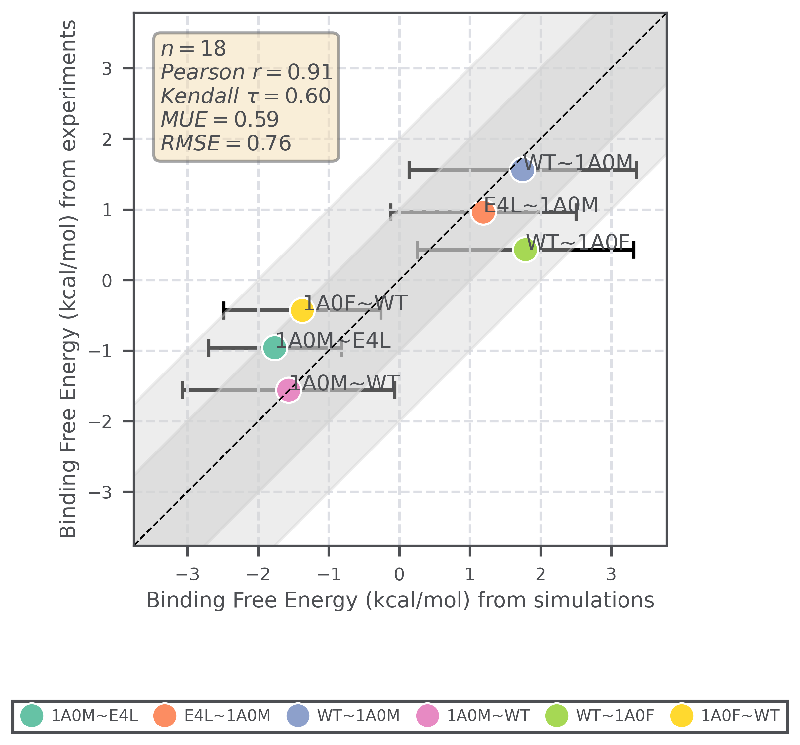
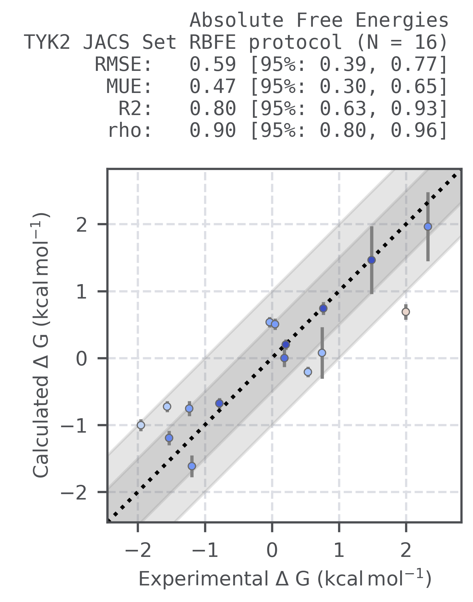

batter
==============================

.. image:: https://github.com/yuxuanzhuang/batter/workflows/CI/badge.svg
   :target: https://github.com/yuxuanzhuang/batter/actions?query=workflow%3ACI

.. image:: https://codecov.io/gh/yuxuanzhuang/batter/branch/main/graph/badge.svg
   :target: https://codecov.io/gh/yuxuanzhuang/batter/branch/main

.. image:: https://readthedocs.org/projects/batter/badge/?version=latest&style=flat
   :target: https://batter.readthedocs.io/en/latest/?badge=latest
   :alt: Documentation Status

``batter`` is a modern, object-oriented toolkit for free-energy workflows.
It provides **absolute binding free energy (ABFE)** and **relative binding free energy (RBFE)**
calculations for ligands, including **charged species** bound to membrane proteins,
as well as **absolute solvation free energy (ASFE)**.
It extends the original `BAT.py <https://github.com/GHeinzelmann/BAT.py>`_ package with the support of
membrane proteins, single-leg ABFE protocols, enhanced sampling via Hamiltonian replica exchange MD (H-REMD),
OpenFF, and a revamped codebase for maintainability and extensibility.

ABFE runs in ``batter`` follow a single-component design that applies lambda-dependent
Boresch restraints, uses the simultaneous decoupling/recoupling (SDR) protocol with both
the interacting and dummy ligands present, and employs soft-core electrostatics and van der Waals
potentials to ensure smooth coupling/decoupling. It also supports usage of H-REMD for enhanced sampling
along the alchemical pathway.

``batter`` supports resuming interrupted runs and flexible system definitions via modular YAML
configuration files. Job submission is highly parallelized, with each lambda-window
executed as an independent job. For example, 10 ligands × 24 lambda-windows yields **240** jobs submitted
concurrently to your scheduler.

Installation
-------------------------------

Clone the repository, initialize submodules, and create the environment:

.. code-block:: bash

   git clone git@github.com:yuxuanzhuang/batter.git
   # If SSH clone fails (or SSH is unavailable), use HTTPS instead:
   # git clone https://github.com/yuxuanzhuang/batter.git
   # For SSH setup tips:
   # https://docs.github.com/en/authentication/connecting-to-github-with-ssh/adding-a-new-ssh-key-to-your-github-account

   cd batter
   git submodule update --init --recursive

   conda create -n batter -y python=3.12
   conda env update -f environment.yml -n batter
   conda activate batter

   # Install batter (editable)
   pip install -e .

The Conda environment installs the bundled ``extern/*`` dependencies through its
``pip`` section. Run the environment update from the repository root so the
relative editable paths resolve correctly.

Installation tips (clusters)
~~~~~~~~~~~~~~~~~~~~~~~~~~~~

- Building the environment can be storage hungry and slow. Try
  `micromamba <https://mamba.readthedocs.io/en/latest/user_guide/micromamba.html>`_
  and/or run the install on a compute node.
- VMD often needs X11 forwarding and its own shared libraries on clusters. Set
  ``LD_LIBRARY_PATH`` to include ``$CONDA_PREFIX/lib/vmd`` (or your env path) and load
  any required ``x11``/``system`` modules before launching VMD. Override the executable
  with ``BATTER_VMD`` if needed.

This installs in editable mode so your code changes are immediately reflected.

To use this package without the core components—useful for running CLI commands (e.g., ``batter report-jobs``),
building docs, or running simple tests—install only the package itself:

.. code-block:: bash

   pip install .

Quickstart
-------------------------------

.. warning::

   The following command will run compute-heavy jobs.

   It will also dispatch multiple MD jobs to your SLURM scheduler.

Run an example configuration:

.. code-block:: bash

   cd examples

   batter seed-headers   # create ~/.batter with SLURM headers

   # modify ~/.batter/***.header to suit your cluster if needed

   batter run mabfe_example.yaml

Use ``--help`` to see all commands:

.. code-block:: bash

   batter -h
   batter run -h

Examples
----------------
YAML files in ``examples/`` illustrate common setups:

**Absolute Binding Free Energy (ABFE)**
   1. ``mabfe_example.yaml`` — membrane protein (e.g., B2AR) in a lipid bilayer
   2. ``mabfe_nonmembrane_example.yaml`` — soluble protein (e.g., BRD4) in water
   3. ``extra_restraints/mabfe.yaml`` — add positional restraints to selected atoms
   4. ``conformational_restraints/mabfe.yaml`` — add conformational restraints (distance between atoms)

**Relative Binding Free Energy (RBFE)**
   1. ``rbfe_example.yaml`` — suitable for small transformations with 24 lambda windows
   2. ``rbfe_48win_example.yaml`` — suitable for larger transformations with 48 lambda windows (e.g. charge changes)

**Absolute Solvation Free Energy (ASFE)**
   1. ``masfe_example.yaml`` — small molecule (e.g., epinephrine) in water

**Plain Molecular Dynamics (MD)**
   1. ``md_example.yaml`` — standard MD production run for a protein-ligand complex

Example YAMLs are intended as starting points; adjust to your system.

Binding of the Tiam1 PDZ Domain to Peptides
~~~~~~~~~~~~~~~~~~~~~~~~~~~~~~~~~~~~~~~~~~~~~~~

``examples/tiam`` contains an example workflow that uses the OpenFF 2.3.0
small-molecule force field to estimate the relative binding free energies of
peptides bound to the Tiam1 PDZ domain.

This benchmark is based on the Tiam1 PDZ peptide system described in the
following study: `Biophysical Journal article <https://www.cell.com/biophysj/fulltext/S0006-3495(18)30105-X?_returnURL=https%3A%2F%2Flinkinghub.elsevier.com%2Fretrieve%2Fpii%2FS000634951830105X%3Fshowall%3Dtrue#tblfn2>`_.

The results below were obtained using 24 lambda windows with 4 ns per window,
without H-REMD.

Absolute and Relative Binding Free Energy Calculations of TYK2
~~~~~~~~~~~~~~~~~~~~~~~~~~~~~~~~~~~~~~~~~~~~~~~~~~~~~~~~~~~~~~~~~~

``examples/tyk2`` contains the input files for absolute and relative binding
free energy calculations on the TYK2 benchmark system.

This benchmark is based on the TYK2 structures provided in the following
repository: `Schrödinger public binding free energy benchmark <https://github.com/schrodinger/public_binding_free_energy_benchmark/tree/main/fep_benchmark_inputs/structure_inputs/jacs_set>`_.

The RBFE results below were obtained using 24 lambda windows with 4 ns per
window, with H-REMD.

Copyright
-------------------------------
**Copyright (c) 2024, Yuxuan Zhuang**

Acknowledgements
-------------------------------
Built with the
`Computational Molecular Science Python Cookiecutter <https://github.com/molssi/cookiecutter-cms>`_ (v1.10).
